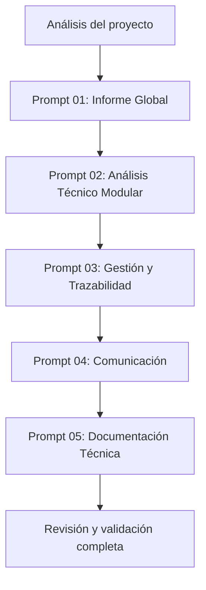
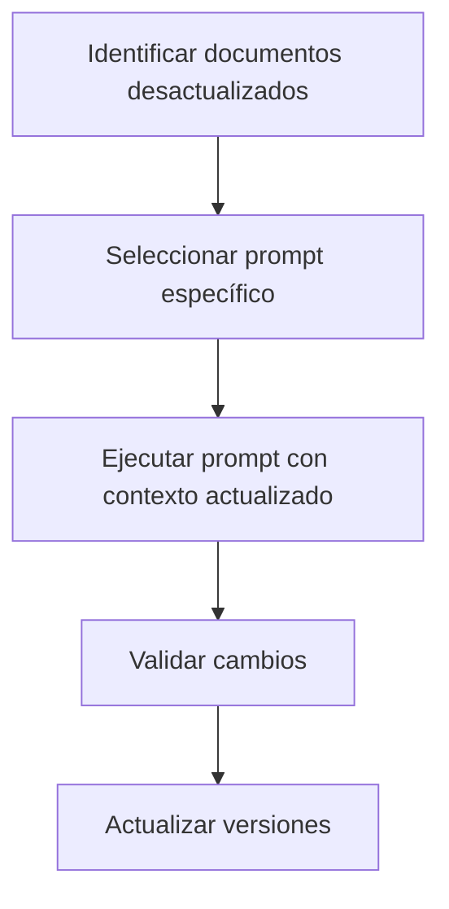

# SISTEMA DE PROMPTS PARA AGENTES IA — DOCUMENTACIÓN AUTOMÁTICA

**Propósito**: Este directorio contiene### 🔧 PERSONALIZACIÓN AUTOMÁTICA

**YA NO NECESITAS personalizar variables manualmente**. Los prompts:

✅ **Preguntan automáticamente**:
- Nombre del proyecto
- Versión actual  
- Stakeholders y audiencias
- Componentes a analizar
- Dominio del proyecto

✅ **Se adaptan automáticamente** al dominio:
- **Médico**: Terminología clínica, compliance, métricas diagnósticas
- **Financiero**: ROI, regulaciones financieras, métricas de negocio
- **Educativo**: Métricas pedagógicas, usabilidad, adopción
- **Otros**: El prompt se adapta según el dominio identificado

✅ **Detectan el contexto**:
- Proyecto nuevo vs actualización
- Documentación existente en LEGACY
- Cambios entre versiones
- Stakeholders actuales vs anterioreseto de prompts especializados que permiten a cualquier agente de IA (Claude, ChatGPT, etc.) generar, actualizar y mantener toda la documentación del proyecto de manera sistemática y profesional.

**Audiencia**: Desarrolladores, gestores de proyecto, y cualquier persona que necesite replicar o actualizar la metodología de documentación en otros proyectos.

---

## 📋 ÍNDICE DE PROMPTS

| Prompt | Propósito | Documentos Generados | Audiencia |
|--------|-----------|---------------------|-----------|
| **[01_PROMPT_ANALISIS_GLOBAL.md](01_PROMPT_ANALISIS_GLOBAL.md)** | Informe estratégico del proyecto | `INFORME_GLOBAL_PROYECTO.md` | Stakeholders ejecutivos |
| **[02_PROMPT_ANALISIS_TECNICO_MODULAR.md](02_PROMPT_ANALISIS_TECNICO_MODULAR.md)** | Análisis técnico por componente | `01_main.md`, `02_ui.md`, etc. | Desarrolladores/Arquitectos |
| **[03_PROMPT_GESTION_Y_TRAZABILIDAD.md](03_PROMPT_GESTION_Y_TRAZABILIDAD.md)** | Gestión y trazabilidad | `CHANGELOG.md`, `BITACORA.md`, `README.md` | Gestores de proyecto |
| **[04_PROMPT_COMUNICACION_STAKEHOLDERS.md](04_PROMPT_COMUNICACION_STAKEHOLDERS.md)** | Comunicación diferenciada | Cuestionarios, reportes ejecutivos | Múltiples audiencias |
| **[05_PROMPT_DOCUMENTACION_TECNICA_ESPECIALIZADA.md](05_PROMPT_DOCUMENTACION_TECNICA_ESPECIALIZADA.md)** | Documentación técnica profunda | Manuales técnicos, APIs | Equipos técnicos avanzados |

---

## 🚀 CÓMO USAR ESTE SISTEMA

### ⚡ MODO AUTOMÁTICO (RECOMENDADO)
Los prompts ahora son **completamente adaptativos**. Solo necesitas:

1. **Copiar el prompt** al agente IA
2. **El prompt preguntará automáticamente**:
   - ¿Es proyecto nuevo o actualización?
   - ¿Cuáles son los stakeholders?
   - ¿Cuál es la versión del proyecto?
   - ¿Qué audiencias objetivo?
   - ¿Hay documentación anterior en LEGACY?
3. **Responder las preguntas** del agente
4. **El agente generará** la documentación completa

### 🎯 SELECCIÓN DE PROMPT

**Para CUALQUIER tipo de documentación**:
- Los prompts detectan automáticamente si es creación o actualización
- Cada prompt maneja su propio scope de documentación
- No necesitas preparar contexto previo

**Para PROYECTOS NUEVOS**:
- Usa cualquier prompt, te preguntará lo que necesite
- El prompt se adapta al dominio (médico, financiero, etc.)

**Para ACTUALIZACIONES**:
- Usa el prompt correspondiente al tipo de documentación
- El prompt buscará automáticamente en LEGACY
- Diferenciará entre documentos acumulativos vs reescritura completa

### 📋 ESTRATEGIA AUTOMÁTICA DE ACTUALIZACIÓN

**DOCUMENTOS ACUMULATIVOS** (se extienden, no se reescriben):
- `CHANGELOG.md` → Añade nueva versión al historial
- `BITACORA_DE_ACERCAMIENTOS.md` → Añade nueva iteración

**DOCUMENTOS DE REESCRITURA** (se reescriben completamente):
- `README.md`, `INFORME_GLOBAL_PROYECTO.md` 
- Todos los análisis técnicos modulares
- Toda la comunicación con stakeholders
- Toda la documentación técnica especializada

---

## 📊 METODOLOGÍA DE DOCUMENTACIÓN SISTEMÁTICA

### Principios Core
1. **Diferenciación por audiencia**: Cada documento está optimizado para una audiencia específica
2. **Profundidad apropiada**: Nivel de detalle técnico según el público objetivo
3. **Actualizable**: Prompts diseñados para ser reutilizables en actualizaciones
4. **Cuantificado**: Énfasis en métricas específicas y beneficios medibles
5. **Accionable**: Información útil para toma de decisiones

### Estándares de Calidad
- **Factualidad**: Solo información extraída del proyecto real
- **Consistencia**: Terminología y formato unificados
- **Completitud**: Cobertura completa según el scope del prompt
- **Navegabilidad**: Enlaces cruzados y estructura clara

---

## 🔄 FLUJO DE TRABAJO RECOMENDADO

### Para Proyecto Nuevo

### Para Actualización de Documentación

---

## 📝 PERSONALIZACIÓN PARA OTROS PROYECTOS

### Variables a Reemplazar
Cada prompt contiene variables que deben personalizarse:

| Variable | Descripción | Ejemplo |
|----------|-------------|---------|
| `[NOMBRE_PROYECTO]` | Nombre del proyecto | "Sistema OCR Médico HUV" |
| `[X.Y.Z]` | Versión actual | "v2.1.0" |
| `[FECHA_ACTUAL]` | Fecha de generación | "2024-01-15" |
| `[AUDIENCIA_N]` | Stakeholders específicos | "Equipo médico", "Dirección" |
| `[COMPONENTE_N]` | Módulos del sistema | "main.py", "ui.py" |

### Adaptación por Dominio
**Para sistemas médicos**: Mantener terminología clínica y compliance
**Para sistemas financieros**: Adaptar a regulaciones financieras y métricas ROI
**Para sistemas educativos**: Enfocar en métricas pedagógicas y usabilidad

---

## ✅ CHECKLIST DE VALIDACIÓN

Antes de considerar completa la documentación generada:

### Validación de Contenido
- [ ] Información factual extraída del proyecto real
- [ ] Métricas específicas y cuantificadas
- [ ] Terminología consistente en todos los documentos
- [ ] Referencias cruzadas funcionando correctamente

### Validación de Formato
- [ ] Markdown correctamente formateado
- [ ] Tablas con datos reales y útiles
- [ ] Diagramas ASCII claros y precisos
- [ ] Estructura de headers consistente

### Validación de Audiencia
- [ ] Lenguaje apropiado para cada stakeholder
- [ ] Nivel de detalle técnico correcto
- [ ] Enfoque en beneficios relevantes por audiencia
- [ ] Accionabilidad de la información presentada

---

## 🔧 MANTENIMIENTO DEL SISTEMA

### Actualización de Prompts
- **Frecuencia**: Cada major release del proyecto
- **Trigger**: Cambios significativos en arquitectura o stakeholders
- **Responsable**: Equipo de documentación o líder técnico

### Evolución del Sistema
- **Nuevas audiencias**: Crear prompts específicos siguiendo el patrón establecido
- **Nuevos tipos de documentos**: Expandir con prompts adicionales
- **Mejores prácticas**: Incorporar aprendizajes en las plantillas

---

## 📞 SOPORTE Y CONTRIBUCIONES

Para mejorar o adaptar este sistema de prompts:

1. **Issues identificados**: Documentar en el issue tracker del proyecto
2. **Mejoras propuestas**: Siguir el proceso de pull request estándar
3. **Nuevos prompts**: Proponer siguiendo la estructura establecida
4. **Feedback de uso**: Compartir experiencias de implementación

---

## 🎉 VENTAJAS DEL SISTEMA ADAPTATIVO

### ✅ **Completamente Autónomo**
- Los prompts hacen todas las preguntas necesarias
- No requiere preparación manual de contexto
- Detecta automáticamente el tipo de proyecto y dominio

### ✅ **Gestión Inteligente de Versiones**
- Diferencia automáticamente entre documentos acumulativos vs reescritura
- Mantiene cronología en CHANGELOG y BITÁCORA
- Reescribe completamente documentos de estado actual

### ✅ **Adaptación Universal**
- Funciona para cualquier dominio (médico, financiero, educativo, etc.)
- Se adapta a cualquier tecnología o stack
- Escalable a proyectos de cualquier tamaño

### ✅ **Calidad Profesional**
- Extraído de análisis de 284 archivos de documentación real
- Patrones probados en producción
- Nivel de detalle apropiado para cada audiencia

---

**Versión del sistema de prompts**: v2.0 (Sistema Adaptativo)  
**Última actualización**: 25 de septiembre de 2025  
**Compatibilidad**: Claude 3.5, ChatGPT 4, y otros LLMs avanzados  
**Modo**: Completamente autónomo y adaptativo

---

*Este sistema de prompts adaptativos es el resultado del análisis de 284 archivos de documentación del proyecto HUV, extrayendo patrones, metodologías y mejores prácticas para crear un framework completamente autónomo de documentación automatizada que se adapta a cualquier proyecto, dominio y contexto.*